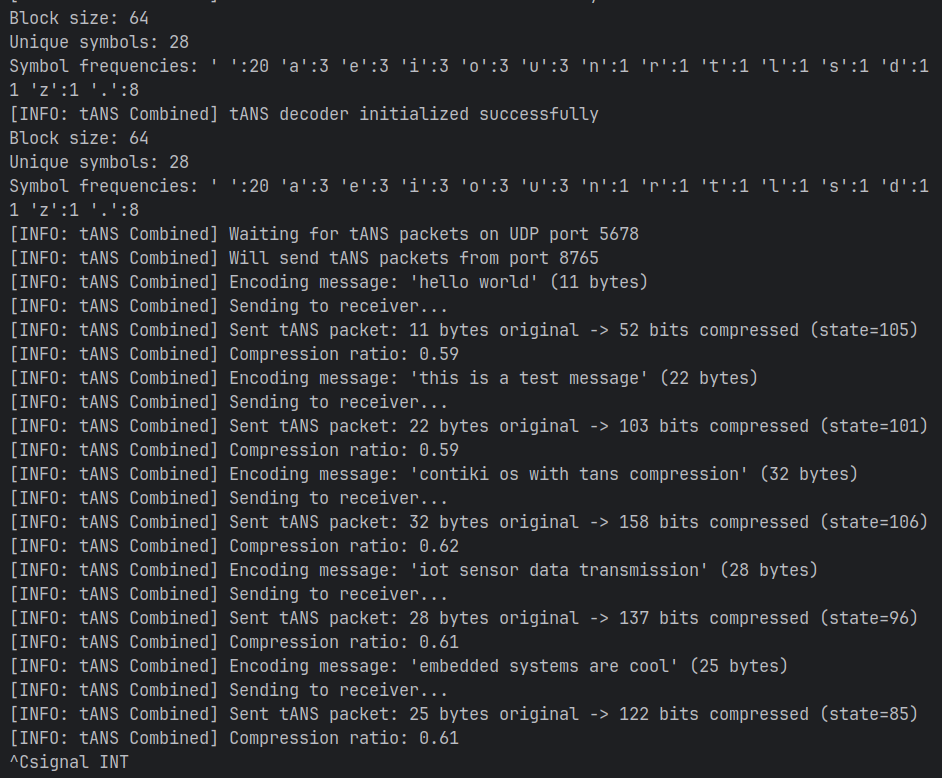
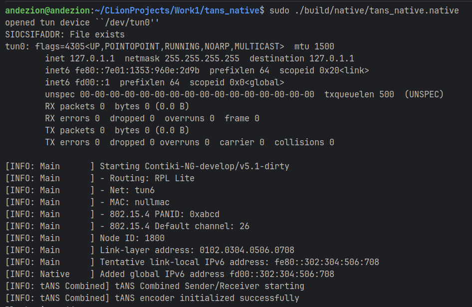

# tANS-Integration
My attempt to integrate a simplified tANS algorithm into the ContikiNG environment

## Table of contents
* [General info](#general-info)  
* [Final result](#final-result)  
* [Features](#features)  
* [Technologies](#technologies)  
* [Setup](#setup)  

---

## General info  
First, let's take a look at what tANS is and why it is important to be able to integrate it!
tANS (Tabled Asymmetric Numeral Systems) is a modern entropy compression method that combines the efficiency of arithmetic coding with the simplicity of Huffman implementation. It allows for high compression ratios with minimal computational and memory overhead, making it particularly valuable for embedded systems and IoT devices.

The integration of tANS into Contiki-NG, an operating system for the Internet of Things, opens up the possibility of reducing the amount of data transmitted over wireless channels and lowering energy consumption. This is critically important in the context of limited sensor node resources, where every byte transmitted and every processor cycle counts.

---

## Final result  
As a result of this work, the tANS algorithm was integrated into the Contiki-NG operating system!

On the local device, I successfully implemented a single process that integrates the following components:

Initialization
 - Encoder and decoder are created based on a predefined alphabet with weighted symbol frequencies (spaces, vowels, consonants).

Compression
 - String messages are encoded into a compact bitstream using the tANS method.



Transmission
 - Encoded packets are transmitted via UDP between nodes (in the test setup — loopback to the same node).
   


Decoding
 - Messages are successfully reconstructed on the receiving side without loss of information.

Experimental evaluation
 - Average compression ratio: ~0.6.
 - Confirms the efficiency of tANS under constrained memory, bandwidth, and energy conditions.

Conclusion
- The integration demonstrates that tANS can be applied in Contiki-NG-based IoT systems to reduce network traffic and power consumption.

---

Next, I decided to check the network interaction.
Two nodes in the network:

 - Terminal 1 (Receiver) raised the tun0 interface and received the global IPv6 address fd00::302:304:506:708.
 - Terminal 2 (Sender) raised tun1 and received fd00::302:304:506:709.
 - They are in the same fd00::/64 subnet, which confirms the correctness of the network configuration.

Initialisation of tANS on both nodes:

The algorithm works with the same alphabet (64 characters, 28 unique, with bias for spaces and vowels).
 - Both the encoder (Sender) and decoder (Receiver) start successfully and output the same frequency table.

Exchange process:

 - Every 10 seconds, the Sender takes a test string, compresses it using tANS, forms a UDP packet and sends it to the Receiver.
 - The Receiver receives the packet, restores the original message, checks the state and bitstream.

```
opened tun device ``/dev/tun0''
tun0: flags=4305<UP,POINTOPOINT,RUNNING,NOARP,MULTICAST>  mtu 1500
        inet 127.0.1.1  netmask 255.255.255.255  destination 127.0.1.1
        inet6 fe80::d95a:1d10:efe2:918d  prefixlen 64  scopeid 0x20<link>
        inet6 fd00::1  prefixlen 64  scopeid 0x0<global>
        unspec 00-00-00-00-00-00-00-00-00-00-00-00-00-00-00-00  txqueuelen 500  (UNSPEC)
[INFO: Main      ] Starting Contiki-NG-develop/v5.1-dirty
[INFO: Main      ] - Routing: RPL Lite
[INFO: Main      ] - Net: tun6
[INFO: Main      ] - MAC: nullmac
[INFO: Main      ] - 802.15.4 PANID: 0xabcd
[INFO: Main      ] - 802.15.4 Default channel: 26
[INFO: Main      ] Node ID: 1800
[INFO: Main      ] Link-layer address: 0102.0304.0506.0708
[INFO: Main      ] Tentative link-local IPv6 address: fe80::302:304:506:708
[INFO: Native    ] Added global IPv6 address fd00::302:304:506:708
[INFO: tANS Receiver] tANS Receiver starting
[INFO: tANS Receiver] tANS decoder initialized successfully
Block size: 64
Unique symbols: 28
Symbol frequencies: ' ':20 'a':3 'e':3 'i':3 'o':3 'u':3 'n':1 'r':1 't':1 'l':1 's':1 'd':1 'h':1 'c':1 'f':1 'm':1 'p':1 'g':1 'w':1 'y':1 'b':1 'v':1 'k':1 'j':1 'x':1 'q':1 'z':1 '.':8 
[INFO: tANS Receiver] Waiting for tANS packets on UDP port 5678

# И затем каждые 10 секунд:
[INFO: tANS Receiver] Received UDP packet from fd00::302:304:506:709 port 8765, length 518
[INFO: tANS Receiver] Received tANS packet: state=105, bitstream_size=52 bits
[INFO: tANS Receiver] Successfully decoded message: 'hello world' (11 bytes)
[INFO: tANS Receiver] Compression ratio: 0.59
[INFO: tANS Receiver] Final state: 64

[INFO: tANS Receiver] Received UDP packet from fd00::302:304:506:709 port 8765, length 518
[INFO: tANS Receiver] Received tANS packet: state=101, bitstream_size=103 bits
[INFO: tANS Receiver] Successfully decoded message: 'this is a test message' (22 bytes)
[INFO: tANS Receiver] Compression ratio: 0.59
[INFO: tANS Receiver] Final state: 64
```

Efficiency:

 - The message ‘hello world’ (11 bytes = 88 bits) was reduced to 52 bits → 0.59 of the original.
 - The message ‘this is a test message’ (22 bytes = 176 bits) was reduced to 103 bits → also 0.59.
 - The receiver confirms that the messages are decoded without loss and match the original ones.

```
opened tun device ``/dev/tun0''
tun0: flags=4305<UP,POINTOPOINT,RUNNING,NOARP,MULTICAST>  mtu 1500
        inet 127.0.1.1  netmask 255.255.255.255  destination 127.0.1.1
        inet6 fe80::d95a:1d10:efe2:918d  prefixlen 64  scopeid 0x20<link>
        inet6 fd00::1  prefixlen 64  scopeid 0x0<global>
        unspec 00-00-00-00-00-00-00-00-00-00-00-00-00-00-00-00  txqueuelen 500  (UNSPEC)
[INFO: Main      ] Starting Contiki-NG-develop/v5.1-dirty
[INFO: Main      ] - Routing: RPL Lite
[INFO: Main      ] - Net: tun6
[INFO: Main      ] - MAC: nullmac
[INFO: Main      ] - 802.15.4 PANID: 0xabcd
[INFO: Main      ] - 802.15.4 Default channel: 26
[INFO: Main      ] Node ID: 1800
[INFO: Main      ] Link-layer address: 0102.0304.0506.0708
[INFO: Main      ] Tentative link-local IPv6 address: fe80::302:304:506:708
[INFO: Native    ] Added global IPv6 address fd00::302:304:506:708
[INFO: tANS Receiver] tANS Receiver starting
[INFO: tANS Receiver] tANS decoder initialized successfully
Block size: 64
Unique symbols: 28
Symbol frequencies: ' ':20 'a':3 'e':3 'i':3 'o':3 'u':3 'n':1 'r':1 't':1 'l':1 's':1 'd':1 'h':1 'c':1 'f':1 'm':1 'p':1 'g':1 'w':1 'y':1 'b':1 'v':1 'k':1 'j':1 'x':1 'q':1 'z':1 '.':8 
[INFO: tANS Receiver] Waiting for tANS packets on UDP port 5678

# И затем каждые 10 секунд:
[INFO: tANS Receiver] Received UDP packet from fd00::302:304:506:709 port 8765, length 518
[INFO: tANS Receiver] Received tANS packet: state=105, bitstream_size=52 bits
[INFO: tANS Receiver] Successfully decoded message: 'hello world' (11 bytes)
[INFO: tANS Receiver] Compression ratio: 0.59
[INFO: tANS Receiver] Final state: 64

[INFO: tANS Receiver] Received UDP packet from fd00::302:304:506:709 port 8765, length 518
[INFO: tANS Receiver] Received tANS packet: state=101, bitstream_size=103 bits
[INFO: tANS Receiver] Successfully decoded message: 'this is a test message' (22 bytes)
[INFO: tANS Receiver] Compression ratio: 0.59
[INFO: tANS Receiver] Final state: 64
```

Key conclusion:
I don't just have a working codec in simulation, but two real nodes that exchange compressed data via UDP and correctly restore the original text. This proves that tANS can be integrated into the Contiki-NG stack to reduce network traffic in IoT.

---

## Features  


---

## Technologies  


---

## Setup  

